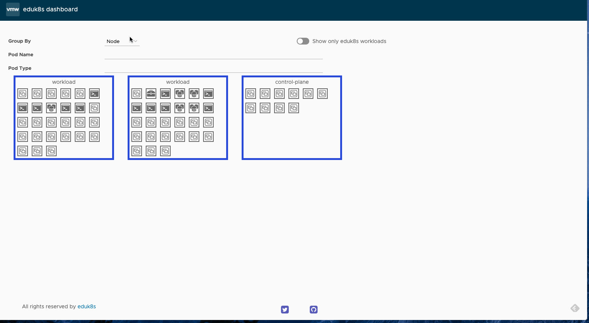

# eduk8s-dashboard — the tiny eduk8s dashboard




## Usage

You can start the dashboard with:

```bash
$ kubectl proxy --www=.
Starting to serve on 127.0.0.1:8001
```

Open the following URL <http://127.0.0.1:8001/static>.

## Related
This project is based by [k8bit](https://github.com/learnk8s/k8bit), which is a tiny dashboard explained in a [blog](https://learnk8s.io/real-time-dashboard)

This project is inspired by [kube-ops-view](https://github.com/hjacobs/kube-ops-view), which is a fully featured dashboard for Kubernetes.